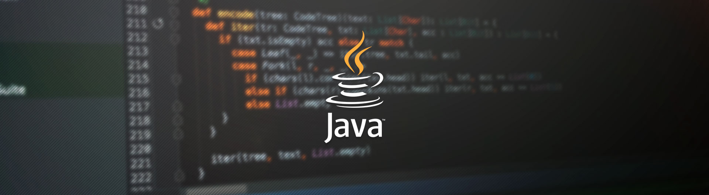

# Java Técnico

Este repositório é um execício de markdown e foi criado para armazenar alguns conteúdos sobre a linguagem de programação java, elaborados em 2022 na turma I2262TD de linguagens de programação do IFPA campus Belém.

## Assuntos que serão abordados:

* Java e ambiente;
* Primeiro programa;
* Variáveis;
* Comandos Básicos;
* Strings;
* Entrada e saída de dados;
* Funções matemáticas;
* Estruturas de controle (seleção);
* Estruturas de Repetição;
* Vetores/arrays;
* Criação de métodos;
* Orientação a objetos;
* Encapsulamento;
* Construtores;
* Herança;
* Polimorfismo.

### Link para conteúdos em pdf:

Arquivos elaborados por: Professor Wellington Vasconcelos Moraes

[Google Drive](https://drive.google.com/drive/folders/1wIi33iqQwbi5N2pQcyc-LMNFcHCWOyaW?usp=share_link)


#### Últimas palavras...

```java
    public class BoaSorte {
    public static void main(String args[]) {
        System.out.print("Bons Estudos :) ");
        }
    }
```